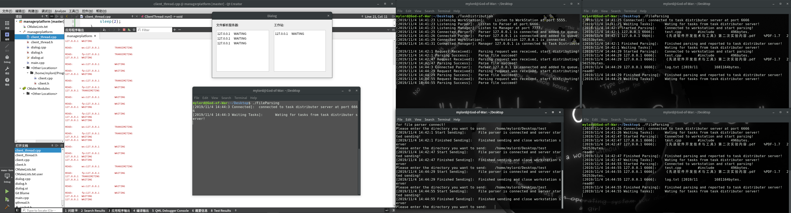

# C++实现分布式文件解析系统

## 一、该系统的应用场景

整个分布式文件解析系统一共有四个角色：任务分配服务器、文件解析服务器、工作站和管理平台。在一个大型的网络中，有若干个用户（即“工作站”）随机地通过“任务分配服务器”向若干个“文件解析服务器”提交文本文件。“文件解析服务器”将收到的文件解析后写入log文件中。“管理平台”负责以可视化的界面观察所有连接到的“任务分配服务器”和“工作站”的ip及工作状态。

<!--more-->


### 1、任务分配服务器

任务分配服务器的作用是轮流地将来自“工作站”的文件传送请求转发到每个在线的“文件解析服务器”上，从而避免某个特定的“文件解析服务器”工作负载太重。“任务分配服务器”轮流给所有在线的“文件解析服务器”分配任务。轮流的原则是按每工作站每批轮流，不考虑每批文件的数量多少。当有“工作站”准备传送一批文件时，首先连接任务分配服务器，通知任务分配服务器有一批文件待传。任务分配服务器则把该工作站的IP和端口告诉选定的“文件解析服务器”，以便让“文件分析服务器”能主动和“工作站”连接，并完成该批文件传输。

ps：主动的含义是文件分析服务器主动通过`connect`连接工作站。“任务分配服务器”本身不接收或转发文件。工作站每次都是按批提交文件，一批文件的数量不等。

### 2、文件解析服务器

“文件解析服务器”每收到用户的一批文件后，就自动对该批文件进行“文件解析”。“文件解析”的功能是：

+ 1、返回文件的前面8个字节和文件长度。
+ 2、把功能1的结果保存起来，具体就是把“文件名，来源IP，来源端口，处理日期，处理时间，前面8个字节，文件长度”作为一条记录写到本地日志文件中，一条记录就是一行。

### 3、管理平台

管理平台的作用是采用图形化的方式展示目前在线的工作站，文件分析服务器的工作状态。能展示工作站的IP，工作状态（传文件中或没有传文件）。能展示文件分析服务器的IP，工作状态（接收文件中，文件分析中，没有传文件，没有文件被分析）。当一个工作站或文件分析服务器宕机，能实时更新状态。

## 二、系统实现

整个系统的工作流程如下图所示：


该项目源码在<https://github.com/toMyLord/DistributedFileParsingSystem>

## 1、DistributedFileParsingSystem/src

src目录下包含`Server`类、`Client`类、`SpecificTime`类。`Server`类用于服务器初始化，监听`socket_fd`，接受来自客户端的连接请求，接收或发送信息，关闭套接字。`Client`类用于客户端初始化，连接服务器，与服务器进行全双工通信，关闭连接。`SpecificTime`类用于获取当前系统的时间，并以规定的格式返回一个`std::string`类型的字符串。上述三个类会被用于所有角色，因此以一个目录的形式单独放在所有角色所属目录外，通过CmakeLists.txt将这些文件的编译相关性联系在一起，从而生成可执行文件。

## 2、DistributedFileParsingSystem/taskdistribution

该目录下为编译`TaskDistribution`所需要的专属文件。在当前目录下的src目录内，定义了`DistributionServer`类，该类内组合了DistributedFileParsingSystem/src目录下的`Server`类。实现`DistributionServer`类的目的是为了使用该类监听特定端口的所有网络连接，并将所有连接的客户端信息都存储在一个`std::vector`容器内。`DistributionServer`类的定义如下：

```C++
enum ClientState {WAITING, TRANSIMITING};

typedef struct {
    ClientInfo client_info;
    ClientState client_state;
}ClientNode;

class DistributionServer {
private:
    Server server;

    //用来存储所有连接至任务分配服务器的工作站
    vector<ClientNode> client_node;

public:
    ......
};
```

在`ClientNode`结构体内嵌套的`ClientInfo`结构体声明和定义在DistributedFileParsingSystem/src/server.h文件内，`ClientInfo`结构体保存了连接到`server`的客户端的`sockaddr_in`、`socket_fd`以及ip信息。`ClientNode`结构体扩展了一个新的字段`client_state`，该字段用来描述客户端的传输状态。

通过`std::vector<ClientNode>`将所有连接的客户端信息都保存下来。每当有新的客户端连接，就使用`client_node.push_back()`将信息保存在内存中。如果有已连接的客户端断开连接，需要用`find_if()`函数配合`lambda`表达式找到在`vector`中的迭代器，然后断开连接并删除`client_node`中对应的数据。具体过程如下：

```C++
auto client_it = find_if(client_node.begin(), client_node.end(),
            [sock_fd](const ClientNode &cli){ return cli.client_info.client_fd == sock_fd; });

client_node.erase(client_it);

close(sock_fd);
```

TaskDistribution_main.cpp是任务分配服务器可执行文件编译所需的主函数。在该文件内声明了两个`DistributionServer`类的实例`workstation_server`和`parsing_server`，一个`Server`类的实例`manager_server`，分别用来处理来自工作站、文件解析服务器、管理平台的连接。因为任务分配服务器只允许一个管理平台连接，因此管理平台选择`Server`类，因为可能会有大量工作站和文件解析服务器连接至任务分配服务器，因此选择`DistributionServer`来分别监听工作站和文件解析服务器的连接端口。

在主函数中，我选择使用`epoll`——IO多路复用技术来监听工作站、文件解析服务器和管理平台的连接请求，从而实现在单进程中对三个端口进行监听。

当有管理平台连接至任务分配服务器后，任务分配服务器就不再处理来自管理平台的连接请求，直到当前管理平台退出。

当有文件解析服务器连接至任务分配服务器后，任务分配服务器会将文件解析添加至就绪队列，等待来自工作站的请求。每当有工作站发出文件传输请求，就将处于就绪队列顶端的文件解析服务器出队列，并分配给当前工作站用来处理解析任务。处理完文件解析任务后，任务分配服务器会将文件解析服务器重新加入队列。

当工作站连接至任务分配服务器后，任务分配服务器会建立一个新的线程用来处理工作站发出的请求。当工作站发出文件解析请求后，该线程会将就绪队列顶端的文件解析服务器分配给工作站，并一直监控整个解析过程，直到解析完成，将文件解析服务器重新入队列。完成后此线程会重新监听来自工作站的解析请求，直到工作站断开连接，该线程就会消亡。如果工作站发出解析请求后，没有任务文件解析服务器就绪，那么任务分配服务器会每过1s检测一次是否有就绪的文件解析服务器（此处可以改进，将每秒轮询的方式改为等待时长者优先策略）。

**注意**：新的任务解析服务器加入了心跳机制，会主动向所有连接的工作站或文件解析服务器主动的发送心跳包，有效的解决了客户端断开连接或者宕机的情况。同时，取消了申请单个线程对新的解析请求进行跟踪。转而使用统一的方式与其他客户端进行交互，有效提高了文件解析服务器的可靠性。

## 3、DistributedFileParsingSystem/fileparsing

该目录下为编译`TaskDistribution`所需要的专属文件。在当前目录下的src目录内，主要实现两个功能：**使用单例模式实现日志文件记录**、**使用状态模式实现文件解析服务器在等待状态和解析状态之间的切换**。

使用单例模式来实现日志记录的`RecordingLog`类的实例只会创建一次，从而避免创建多个日志类实例，造成写入混乱的情况。`RecordingLog`类会将特定信息以`filesteam`的方式写入文件中，具体被记录在日志文件中的信息包括接收来自工作站文件的时间、日期、工作站ip、工作站端口、文件名、文件前8个字节内容、文件总长度。该类的声明情况如下所示：

```C++
//记录文件分析结果log的类，使用单例模式
class RecordingLog {
private:
    //阻止编译器自动生成copying操作
    RecordingLog(RecordingLog &) = delete;
    RecordingLog & operator=(const RecordingLog &) = delete;

    //必须为静态，类外会将其赋值nullptr
    static RecordingLog * log_ptr;

    ofstream out_file;

public:
    RecordingLog();

    //懒汉单例模式在类内实现的函数会被编译器自动转化为内联函数。使用内联函数的目的是在调用时提高效率。
    static inline RecordingLog * getLogInstance() {
        if(log_ptr == nullptr){
            log_ptr = new RecordingLog();
        }
        return log_ptr;
    }

    void WriteLog(const string & log);
};

RecordingLog * RecordingLog::log_ptr = nullptr;
```

在本系统的FileParsing程序中，使用状态模式用来处理文件解析服务器的状态转换。文件解析服务器主要有两种状态——等待任务分配服务器发送解析文件请求状态和接受来自工作站的文件并完成解析，写入日志文件的状态。

在第一种状态下，文件解析服务器收到来自任务分配服务器的解析请求后，会将需要主动连接的工作站的ip及端口保存下来，并切换到第二种状态。

在第二种状态下，文件解析服务器根据保存的ip和端口主动连接工作站，连接完成后接收来自工作站的文件信息，解析后通过`RecordingLog`类中的`getLogInstance()`函数将解析后的结果写入日志文件，完成后会将解析完成情况回传给任务分配服务器，在任务分配服务器中，将该文件解析服务器重新添加到就绪队列。之后会主动切换到第一种状态，再次等待任务请求。

```C++
class FileParsing;

//状态模式的基类

class State {
public:
    virtual void Handler(FileParsing * fp) = 0;
    //析构函数设置成虚函数避免派生类在析构的时候只调用基类的析构函数造成不完全析构
    virtual ~State() = default;
};

//等待连接状态
class WatingState : public State {
public:
    void Handler(FileParsing * fp);

    ~WatingState() = default;
};

//文件解析状态,在这种状态下会使用记录log的类RecordingLog
class ParsingState : public State {
public:
    void Handler(FileParsing * fp);

    ~ParsingState() = default;
};


//文件解析类，使用状态模式，在解析文件状态和等待连接状态中切换
class FileParsing {
private:
    //用来接收派生类的指针
    State * state;
    Client parsing_client;

    WatingState * ws;
    ParsingState * ps;

public:
    char workstation_ip[16];
    int workstation_port;

    FileParsing(char * ip, int port = 6666);

    void Init();

    inline void setState(State * s);

    void Handler();

    WatingState * getWatingState();

    ParsingState * getParsingState();

    ~FileParsing();
};


void FileParsing::Handler() {
    state->Handler(this);
}


void WatingState::Handler(FileParsing * fp) {
    ......

    fp->setState(fp->getParsingState());
}


void ParsingState::Handler(FileParsing * fp) {
.......
    fp->setState(fp->getWatingState());
}
```

这部分程序使用了状态模式，使得文件解析服务器在等待分配任务状态及解析文件状态自动切换，从而保证了两种状态上的逻辑分离，具有非常好的封装性，并体现了开闭原则和单一职责原则：每个状态都是一个子类，如果需要增加状态就只需要增加子类，如果需要修改状态，就只需要修改一个子类即可完成，具有很高的扩展性。

## 4、DistributedFileParsingSystem/workstation

该目录下为编译`WorkStation`所需要的专属文件。在当前目录下的src目录内，定义了`SendDirectory`类。通过该类，可以实现根据输入的一个目录，自动发送该目录下的所有文件。注意，该目录下不可再包含目录。

## 5、DistributedFileParsingSystem/managerplatform

该目录下为编译`Managerplatform`所需要的专属文件。此目录可以使用QtCreater打开，但是编译还是需要根据DistributedFileParsingSystem/CMakeLists.txt文件通过cmake编译。

该目录下的`ClientThread`类通过继承`QThread`类，实现在Qt中使用线程。在该部分程序运行时，就会创建一个`ClientThread`线程，用于与任务分配服务器建立连接，并不断接受来自任务分配服务发送的有关工作站及文件解析服务器的在线状态以及传输状态。每当有新的信息后，就通过Qt的槽机制，发送给`QDialog`，显示在界面中。

## 三、编译及运行

## 1、编译过程

```shell
cd ~
git clone https://github.com/toMyLord/DistributedFileParsingSystem.git
cd DistributedFileParsingSystem
cmake .
make
```


编译完成后会生成四个可执行文件：TaskDistribution、FileParsing、WorkStation、ManagerPlatform。

运行过程如下所示：
首先分别运行每个可执行程序，其中运行两个FileParsing程序（上线两个文件解析服务器）：

在WorkStation程序下输入需要发送的文件目录：

会发现第一个上线的文件解析服务器已经完成了解析任务，并且管理平台有相应的状态变化（时间太短，可以通过管理平台的log信息观察得到），同时任务分配服务器收到相应的解析完成信号。我们在WorkStation程序下再次输入需要发送的文件目录，再次发送文件：

我们可以观察到后上线的文件解析服务器在处理解析任务，并已经解析完成。同时任务分配服务器、管理平台也有相应的变化。我们继续上线一个文件解析服务器：

可以在任务分配服务器的log中看到有新上线的文件解析服务器，同时在管理平台也可以看到对应的文件解析服务器。我们通过工作站连续发送三次文件。



我们可以观察到，处理解析任务的顺序依次是最先上线的文件解析服务器、第二个上线的文件解析服务器以及最新上线的文件解析服务器，符合预期。同时管理平台的界面显示和log显示、任务分配服务器的log显示也符合预期。我们再打开file_parse.log查看日志记录情况：

日志内容也符合预期，整个系统成功运行。

## ChangeLog

### V1.0 2019-11-06

实现了整个分布式任务解析服务器框架，整个项目可以正常实现需求功能。
缺陷：任务分配服务器存在不能正常处理所有连接的正常close。

### V2.0 2019-11-11

在任务分配服务器处新增了心跳包机制——任务分配服务器会每隔5s向所有连接在线的文件解析服务器和工作站发送心跳包，文件解析服务器和工作站在收到心跳包后，也会主动回应心跳。通过心跳包机制可以很好的处理来自其他连接的断开情况。同时新增了在管理平台退出后，任务分配服务器可以重新接受来自管理平台的连接。
